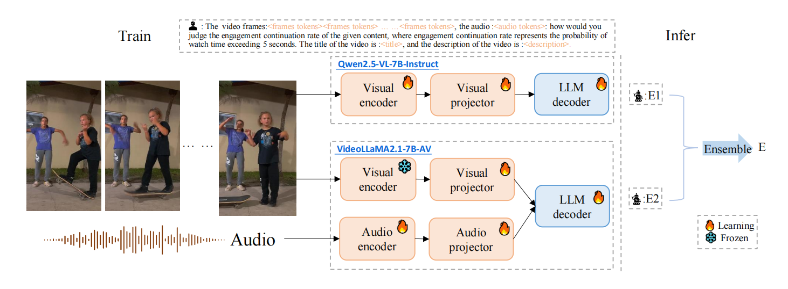

# LMM-EVQA
 [](https://github.com/sunwei925/LMM-EVQA)
[](https://github.com/sunwei925/LMM-EVQA)
[](https://arxiv.org/abs/2508.02516)
[](https://codalab.lisn.upsaclay.fr/competitions/23005)

<div align="center">

🏆 **🥇 Winner Solution** for [ICCV VQualA 2025 EVQA-SnapUGC Challenge](https://codalab.lisn.upsaclay.fr/competitions/23005) at [VQualA 2025](https://vquala.github.io/) Workshop @ ICCV 2025

**Official Implementation** for **Engagement Prediction of Short Videos with Large Multimodal Models**
</div>

---

## 📖 Introduction

The rapid proliferation of user-generated content (UGC) on short-form video platforms has made video engagement prediction increasingly important for optimizing recommendation systems and guiding content creation. However, this task remains challenging due to the complex interplay of factors such as semantic content, visual quality, audio characteristics, and user background.

In this work, we empirically investigate the potential of large multimodal models (LMMs) for video engagement prediction. We adopt two representative LMMs:

- **VideoLLaMA2**: Integrates audio, visual, and language modalities
- **Qwen2.5-VL**: Models only visual and language modalities

Both models demonstrate competitive performance against state-of-the-art baselines, showcasing the effectiveness of LMMs in engagement prediction. Notably, VideoLLaMA2 consistently outperforms Qwen2.5-VL, highlighting the importance of audio features in engagement prediction.

## 🏆 Performance

### ICCV VQualA 2025 EVQA Challenge Results

| **Team Name** | **Final Score** | **SROCC** | **PLCC** |
|:--------------|:---------------|:----------|:---------|
| **🥇 ECNU-SJTU VQA (Ours)** | **0.710** | **0.707** | **0.714** |
| IMCL-DAMO | 0.698 | 0.696 | 0.702 |
| HKUST-Cardiff-MI-BAAI | 0.680 | 0.677 | 0.684 |
| MCCE | 0.667 | 0.660 | 0.668 |
| EasyVQA | 0.667 | 0.664 | 0.671 |
| Rochester | 0.449 | 0.405 | 0.515 |
| brucelyu | 0.441 | 0.439 | 0.444 |

> **Note**: Final score = 0.6 × SROCC + 0.4 × PLCC

> **For more detailed results, please refer to the challenge report paper.**

## 🏗️ Model Architecture

<div align="center">

</div>

## 📊 Dataset

### SnapUGC Dataset

### 📥 Download Links

#### 📄 CSV Files
- **Training CSV**: [Google Drive](https://drive.google.com/file/d/1Mv5Esq5gGuxRTayabRUb5NmHwEN3JdbD/view) 
- **Validation CSV**: [Google Drive](https://drive.google.com/file/d/1iY7qUfqivYzUqUID501dKQDpI3NQil7y/view)

#### 🎥 Video Files
- **Training Videos**: [Google Drive](https://drive.google.com/drive/folders/134gJflcaQ7Dhg5EUKfLdeXW61fj1fiNo?usp=share_link) | [Baidu Yun](https://pan.baidu.com/s/18nk2BzrykyHusfTDX5w7xg?pwd=edts) (extraction code: `edts`)
- **Validation Videos**: [Google Drive](https://drive.google.com/file/d/15pIdfXoOGnTye-99K8Wror7sMNU0uzh-/view?usp=share_link) | [Baidu Yun](https://pan.baidu.com/s/1UtTXwgb13B7lxDFjtLPx5g) (extraction code: `28tq`)

### 📁 Dataset Structure
```
SnapUGC/
├── train_data.csv          # Training annotations
├── val_data.csv            # Validation annotations  
├── train_videos/           # Training video files
└── val_videos/            # Validation video files
```

## 🚀 Quick Start

### VideoLLaMA2

#### Environment Setup
```bash
cd VideoLLaMA2-audio_visual

# Create conda environment
conda create -n videollama2 python=3.9
conda activate videollama2

# Install dependencies
pip install -r requirements.txt
```

#### Download Pre-trained Models
```bash
# Download model weights
python download_model_weight.py
# --local_dir specifies the target directory for model weights
```

#### Dataset Preparation
```bash
# Prepare training dataset
python prepare_dataset.py
# VIDEO_DIR = " " # Path to video directory
# AUDIO_DIR = " " # Audio directory parameter (deprecated) - VideoLLaMA2 automatically extracts audio features from video files
# CSV_PATH = "train_data.csv" # Input CSV file containing video metadata
# OUTPUT_TRAIN = "train.json" # Output JSON file for training data
```

#### Training
```bash
# Start training
sh train.sh
# --model_path # Path to pre-trained model weights
# --data_path # Path to training data JSON file
# --num_frames # Number of frames to extract from each video (first N frames)
# --output_dir # Directory for saving trained model weights
# --num_train_epochs # Total number of training epochs
# --per_device_train_batch_size # Batch size per GPU device
```

#### Testing

**Batch Testing:**
```bash
# Generate validation dataset
python prepare_dataset.py

# Run validation
sh run_validation.sh
# --model-path # Path to the trained model weights
# --modal-type # Specify "av" mode for audio-visual evaluation
# --json_file # Path to the validation JSON file
```

**Single Video Testing:**
```bash
python videollama2/test_single_video.py \
    --model-path /path/to/trained/model \
    --modal-type av \
    --video-path /path/to/video.mp4 \
    --title "Your Video Title" \
    --description "Your Video Description"
```

**Parameters:**
- `--model-path`: Path to trained model weights (required)
- `--modal-type`: Modal type - "a" (audio), "v" (video), "av" (audio-visual)
- `--video-path`: Path to video file (required)
- `--title`: Video title (optional, default: None)
- `--description`: Video description (optional, default: None)

### Qwen2.5-VL

#### Environment Setup
```bash
cd Qwen2.5-VL

# Create conda environment
conda create -n qwenvl python=3.9
conda activate qwenvl

# Follow official Qwen2.5-VL installation
# https://github.com/QwenLM/Qwen2.5-VL
```

#### Dataset Preparation
```bash
# Prepare dataset for testing
python prepare_dataset_qwenvl.py
# VIDEO_DIR = " " # Path to the folder containing video files
# CSV_PATH = " " # Path to the provided CSV file
# OUTPUT_TRAIN = " " # Path to the output JSON file used for testing
```

#### Testing

**Batch Testing:**
```bash
python infer_evqa.py \
    --model-path /path/to/trained/model \
    --video-folder /path/to/video/folder \
    --question-file /path/to/question.json \
    --save-csv /path/to/result.csv
```

**Single Video Testing:**
```bash
python test_single_video_qwenvl.py \
    --model-path /path/to/trained/model \
    --video-path /path/to/video.mp4 \
    --title "Your Video Title" \
    --description "Your Video Description"
```

**Parameters:**
- `--model-path`: Path to trained Qwen2.5-VL model weights (required)
- `--video-path`: Path to video file (required)
- `--title`: Video title (optional, default: None)
- `--description`: Video description (optional, default: None)

## 📦 Pre-trained Models

### VideoLLaMA2
- **Download**: [Baidu Yun](https://pan.baidu.com/s/17AGQyy-6QKY5V7C0BjVZeA) (extraction code: `3aqc`)

### Qwen2.5-VL
- **Download**: [Baidu Yun](https://pan.baidu.com/s/1mUU1ekaiPCKHI1KX4Z_LdA) (extraction code: `98zr`)

## 📝 Citation

If you find this code useful for your research, please cite our paper:

```bibtex
@inproceedings{sun2025engagement,
  title={Engagement Prediction of Short Videos with Large Multimodal Models},
  author={Sun, Wei and Cao, Linhan and Cao, Yuqin and Zhang, Weixia and Wen, Wen and Zhang, Kaiwei and Chen, Zijian and Lu, Fangfang and Min, Xiongkuo and Zhai, Guangtao},
  booktitle={Proceedings of the IEEE/CVF Conference on Computer Vision (ICCV) Workshops},
  pages={1--10},
  year={2025}
}
```

## 📄 License

This project is licensed under the Apache License 2.0 - see the [LICENSE](LICENSE) file for details.

## 🙏 Acknowledgments

- Thanks to the organizers of [VQualA 2025](https://vquala.github.io/) and [Snap Chat](https://www.snapchat.com/) for hosting the challenge
- Thanks to the [SnapUGC](https://codalab.lisn.upsaclay.fr/competitions/23005) dataset providers
- Thanks to [VideoLLaMA2](https://github.com/DAMO-NLP-SG/VideoLLaMA2) for providing the excellent multimodal foundation model
- Thanks to [Qwen2.5-VL](https://github.com/QwenLM/Qwen2.5-VL) for providing the powerful vision-language model
- Thanks to the open-source community for providing excellent tools and frameworks

---

**⭐ Star this repository if you find it helpful!**